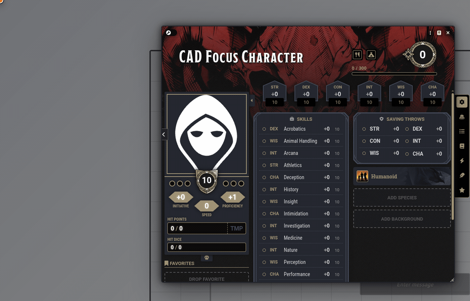
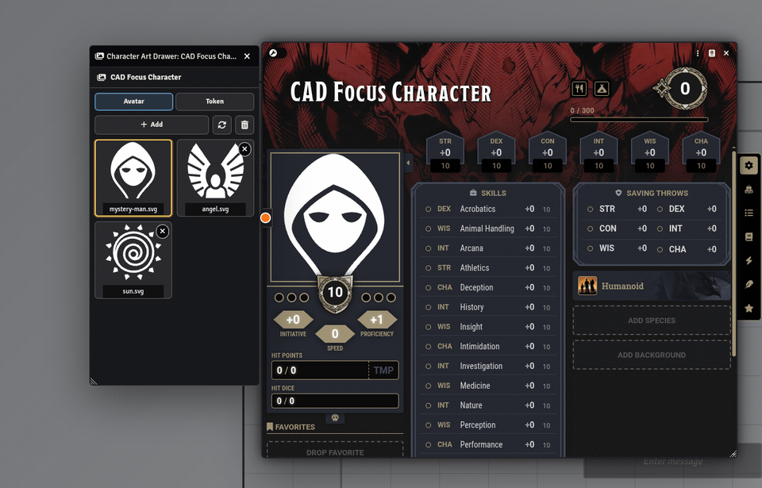
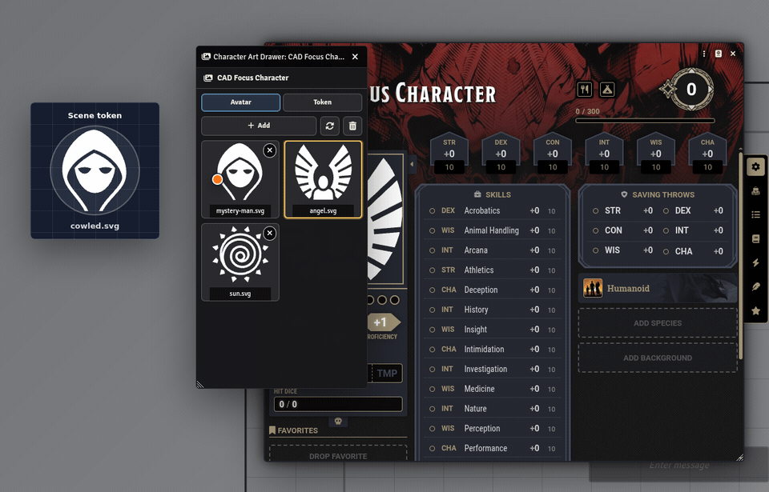

# Character Art Drawer

Character Art Drawer is a Foundry VTT module for Dungeons & Dragons 5th Edition character sheets. It adds a compact side drawer where users can keep, preview, and switch character avatar and token artwork without leaving the actor sheet workflow.

## Features

- Adds an art drawer button to D&D 5e character sheets.
- Stores separate avatar and token image histories per actor.
- Switches the actor avatar image from the drawer.
- Switches the prototype token image from the drawer.
- Can automatically update linked tokens on the active scene when token art changes.
- Provides a manual scene token update button for worlds where automatic token updates are disabled.
- Supports soft delete from gallery history.
- Includes an optional hard delete mode, with safety checks and active-image protection.
- Prevents deleting the currently active image from the drawer.
- Supports left-side resizing so the drawer can sit beside the character sheet.
- Includes English, Russian, Spanish, Brazilian Portuguese, French, Japanese, and Simplified Chinese localization.

## Compatibility

- Foundry VTT: v12 and v13. The manifest intentionally marks these versions as unverified so Foundry shows the module as available at your own risk.
- Game system: D&D 5e v4.x and v5.x. The module has been smoke-tested with D&D 5e v4.3.9 on Foundry VTT v12 Build 331.

The module only activates for D&D 5e character actors.

## Demo

### Open the Art Drawer

### Change Character Art

### Change and Refresh Token Art

## Installation

### Manual Installation

1. Place the `character-art-drawer` folder in your Foundry user data modules directory:

   `Data/modules/character-art-drawer`

2. Restart Foundry VTT.
3. Enable `Character Art Drawer` in your world's module settings.

### Manifest Installation

When this module is published, install it from its public `module.json` manifest URL using Foundry's module installer.

## Usage

Open a D&D 5e character sheet and click the drawer button near the sheet header. Use the Avatar and Token tabs to manage the actor's portrait and prototype token art.

The plus button adds an image to the current gallery tab. Selecting an image makes it active for the actor. The scene token update button applies the actor's current prototype token image to matching linked tokens on the active scene.

Soft delete removes an image from the drawer history only. It does not delete the underlying file.

Hard delete mode changes delete buttons to attempt physical file deletion. In Foundry VTT v13 Build 351, the public module API does not expose file deletion, so hard delete will report that file deletion is unsupported instead of removing the file. If a future Foundry API exposes safe file deletion, the module is already structured to use it.

## Settings

- Default gallery mode: choose whether the drawer opens on Avatar or Token first.
- Automatically remember externally changed images: adds avatar and prototype token images changed outside the drawer to the gallery.
- Update active scene tokens when prototype token image changes: automatically updates matching linked tokens on the active scene when token art is selected.
- Enable hard delete by default: opens new drawers with hard delete mode active.

## Localization

Included languages:

- English
- Russian
- Spanish
- Brazilian Portuguese
- French
- Japanese
- Simplified Chinese

## License

This module is released under the MIT License. See `LICENSE` for details.
